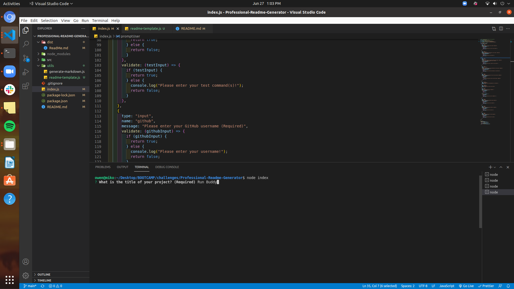

# Professional Readme Generator

## Description 
An application that allows the user to answer prompted questions with inquirer that then
creates a readme with the answers provided. Questions marked "Required" must be answered 
by the user in order for the application to properly create the readme.

---

## Table of Contents 
* [Installation](#installation)
* [Usage](#usage)
* [License](#license)
* [Questions](#questions)

---

## Installation
After cloning the repository, run 'npm init' as well as 'npm install inquirer' in order to 
use the application.

---

## Usage 
To start the application, type 'node index.js' in the terminal, then answer the prompted 
questions appropriately. Click on the link below to view an instructional video on how to
use the application.

[Instruction Video](https://drive.google.com/file/d/17ImgrE4O5ILBL6tz7MZEBL98D9X42Gi2/preview)

---

## License
MIT

Copyright (c) 2021 Owen Dupree

Permission is hereby granted, free of charge, to any person obtaining a copy
of this software and associated documentation files (the "Software"), to deal
in the Software without restriction, including without limitation the rights
to use, copy, modify, merge, publish, distribute, sublicense, and/or sell
copies of the Software, and to permit persons to whom the Software is
furnished to do so, subject to the following conditions:

The above copyright notice and this permission notice shall be included in all
copies or substantial portions of the Software.

---

## Questions
For any questions please contact me directly.
  
Email: <odupree1988@gmail.com>
  
GitHub: [odupree1988](https://github.com/odupree1988) 

Made By Owen Dupree 2021

  ---